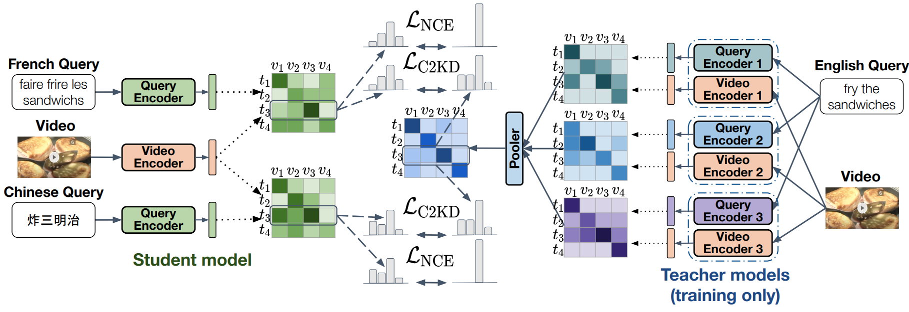
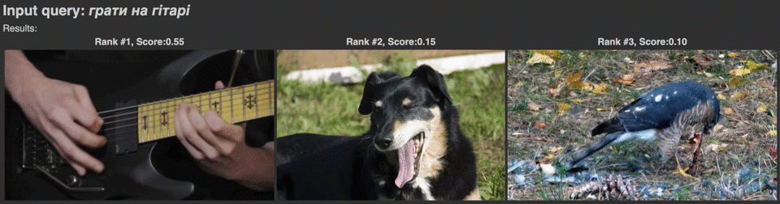
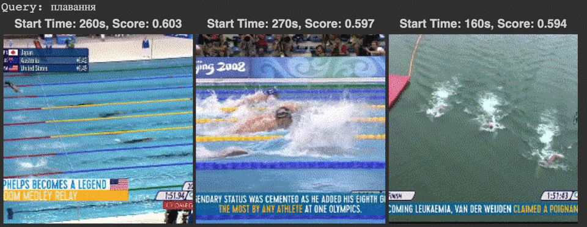

# C2KD: Cross-Lingual Cross-Modal Knowledge Distillation for Multilingual Text-Video Retrieval

[C2KD: Cross-Lingual Cross-Modal Knowledge Distillation for Multilingual Text-Video Retrieval. Andrew Rouditchenko et al. ICASSP 2023 ](https://arxiv.org/abs/2210.03625)

Multilingual text-video retrieval methods have improved significantly in recent years, but the performance for other languages lags behind English. We propose a Cross-Lingual Cross-Modal Knowledge Distillation method to improve multilingual text-video retrieval. Inspired by the fact that English text-video retrieval outperforms other languages, we train a student model using input text in different languages to match the cross-modal predictions from teacher models using input text in English. We propose a cross entropy based objective which forces the distribution over the student's text-video similarity scores to be similar to those of the teacher models. We introduce a new multilingual video dataset, Multi-YouCook2, by translating the English captions in the YouCook2 video dataset to 8 other languages. Our method improves multilingual text-video retrieval performance on Multi-YouCook2 and several other datasets such as Multi-MSRVTT and VATEX. We also conducted an analysis on the effectiveness of different multilingual text models as teachers.

[Check out our ICASSP presentation on YouTube!](https://youtu.be/oZ-lch3Njpw)
[](https://youtu.be/oZ-lch3Njpw)

## Demos
We support two demos:

(1) Multilingual text-video retrieval: given a text query and a candidate set of videos, rank the videos according to the text-video similarity.
[](https://colab.research.google.com/drive/1yeyjrzAP5VQCtHF6xZNuH2MjRzwMgeNR?usp=sharing)

(2) Multilingual text-video moment detection: given a text query and clips from a single video, find the most relevant clips in the video according to the text-video similarity.
[](https://colab.research.google.com/drive/1iMMhfG9qEj2RiC60T8VLF3xsJaPYsLH3?usp=sharing)

The model we demo was trained on MultiMSRVTT on text-video pairs in English, Dutch, French, Mandarin, Czech, Russian, Vietnamese, Swahili, and Spanish. However, thanks to LaBSE's pre-training on over 100 languages (https://aclanthology.org/2022.acl-long.62.pdf), text-video retrieval works in many more languages like Ukrainian and Igbo (shown in the demo). You can try it in whatever language you speak / write.

Multilingual text-video retrieval demo: [](https://colab.research.google.com/drive/1yeyjrzAP5VQCtHF6xZNuH2MjRzwMgeNR?usp=sharing)

Multilingual video moment detection demo: [](https://colab.research.google.com/drive/1iMMhfG9qEj2RiC60T8VLF3xsJaPYsLH3?usp=sharing)

## Get started

Repository contains:
* code for the main experiments
* model weights to obtain main results
* data for fine-tuning and evaluation on the Multi-MSRVTT, Multi-YouCook2, Vatex, and RUDDER datasets

1. Create an environment (tested on May 1st, 2023):
   ```
   conda create python=3.8 -y -n c2kd
   conda activate c2kd
   conda install -y pytorch==1.11.0 cudatoolkit=10.2 -c pytorch
   pip install numpy==1.19.2 transformers==4.16.2 librosa==0.8.1 timm==0.5.4 scipy==1.5.2 gensim==3.8.3 sacred==0.8.2 humanize==3.14.0 braceexpand typing-extensions psutil ipdb dominate
   # optional - for neptune.ai experiment logging
   pip install numpy==1.19.2 neptune-sacred
   ```
2. Download the model weights [here](https://data.csail.mit.edu/placesaudio/c2kd/weights.tar.gz) and the data [here](https://data.csail.mit.edu/placesaudio/c2kd/data.tar.gz). Extract the tars:
   `mkdir data && tar -xvf data.tar.gz -C data` and `mkdir weights && tar -xvf weights.tar.gz -C weights`. They should be in the `data` and `weights` directory, respectively.
   
3. See `./scripts/` for the commands to train the models with our proposed C2KD knowledge distillation, as well as the baseline translate-train and zero-shot (English-only training) methods.
- Note: the results in the paper are the average of 3 runs, so your results might be slightly different than ours.
- Note: for YouCook2, the final results are reported with S3D features from [MIL-NCE](https://github.com/antoine77340/S3D_HowTo100M) as the performance was better than with the CLIP features. We include S3D and CLIP features for YouCook2 and MSR-VTT.


## Experiment Logging

This repository uses [Sacred](https://github.com/IDSIA/sacred) with a [neptune.ai](https://neptune.ai) for logging and tracking experiments.
If you want to activate this:
1. Create a [neptune.ai](https://neptune.ai) account.
2. Create a project, copy in your credentials (api_token, project_name) in `train.py` 
3. Add `--neptune` key to the training (e.g. `python train.py --neptune ..`)

## Cite

If you use this code in your research, please cite:

```bibtex
@article{rouditchenko2022c2kd,
  title={C2KD: Cross-Lingual Cross-Modal Knowledge Distillation for Multilingual Text-Video Retrieval},
  author={Rouditchenko, Andrew and Chuang, Yung-Sung and Shvetsova, Nina and Thomas, Samuel and Feris, Rogerio and Kingsbury, Brian and Karlinsky, Leonid and Harwath, David and Kuehne, Hilde and Glass, James},
  journal={arXiv preprint arXiv:2210.03625},
  year={2022}
}
```

## Contact

If you have any problems with the code or have a question, please open an issue or send an email.

## Acknowledgments and Licenses

The main structure of the code is based on everything-at-once https://github.com/ninatu/everything_at_once and frozen-in-time https://github.com/m-bain/frozen-in-time, which itself is based  on the pytorch-template https://github.com/victoresque/pytorch-template.

The code in `davenet.py`, `layers.py`, `avlnet.py` is partly derived from https://github.com/dharwath/DAVEnet-pytorch/, https://github.com/wnhsu/ResDAVEnet-VQ, https://github.com/antoine77340/howto100m, and https://github.com/roudimit/AVLnet, and is licensed under BSD-3 (David Harwath, Wei-Ning Hsu, Andrew Rouditchenko) and Apache License 2.0 (Antoine Miech).